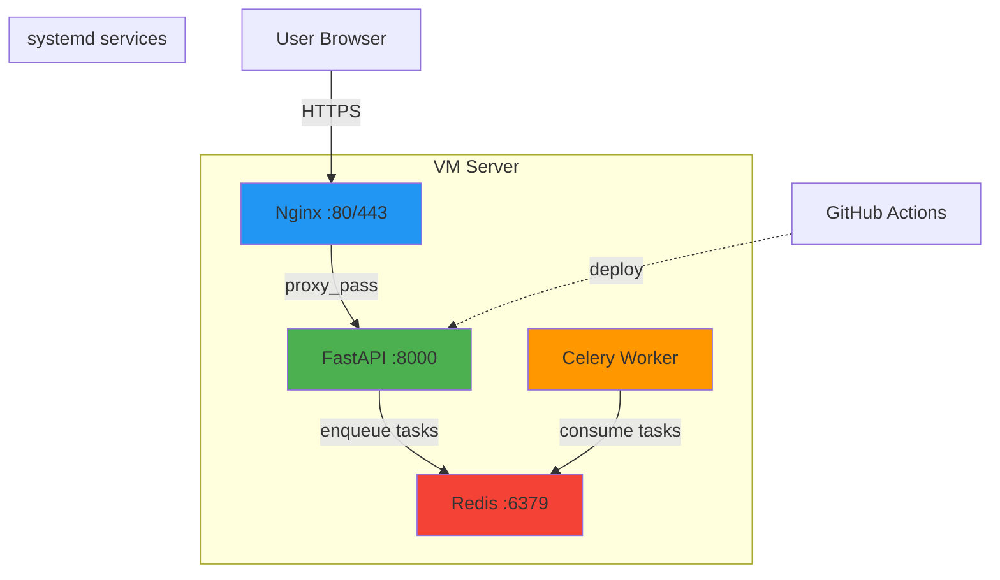
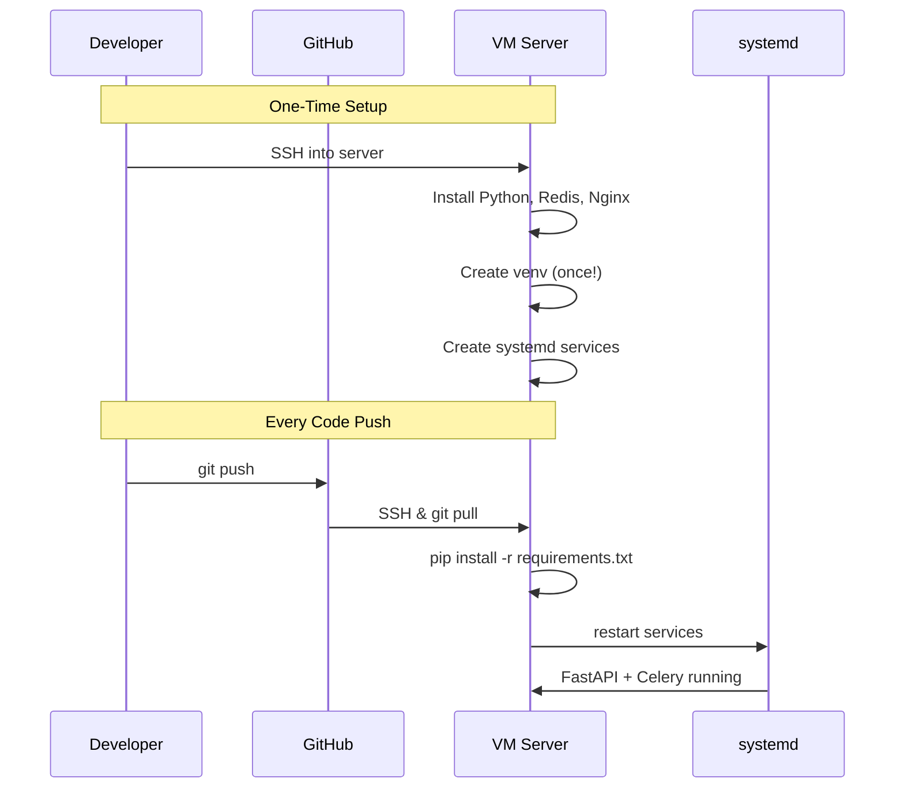

# FastAPI + Celery + Redis + Nginx Deployment Guide

> **Learn production deployment on a single VM** - A practical guide for Python developers deploying FastAPI applications with background tasks, reverse proxy, and CI/CD automation.

---

## What You'll Learn

- Deploy FastAPI applications on a Linux VM
- Run background tasks with Celery + Redis
- Configure Nginx as a reverse proxy
- Create systemd services for production
- Automate deployments with GitHub Actions
- Monitor and troubleshoot your application

---

## Architecture Overview



---

## Quick Navigation

### 🚀 Getting Started
1. [Initial Server Setup](docs/01-initial-setup.md) - Install Python, Redis, Nginx (first-time only)
2. [FastAPI Application Structure](docs/02-fastapi-setup.md) - Project setup and routing
3. [systemd Services](docs/03-systemd-services.md) - Run FastAPI + Celery as services
4. [Nginx Configuration](docs/04-nginx-config.md) - Reverse proxy setup
5. [GitHub Actions CI/CD](docs/05-github-actions.md) - Automated deployments
6. [Monitoring & Logs](docs/06-monitoring.md) - Troubleshooting guide

### 📁 Ready-to-Use Examples
- [Sample FastAPI App](examples/fastapi-app/) - Complete working example
- [systemd Service Files](examples/systemd/) - FastAPI + Celery templates
- [Nginx Config](examples/nginx/) - Reverse proxy template
- [GitHub Actions Workflow](examples/github-actions/) - CI/CD pipeline

---

## Prerequisites

- **Linux VM** with SSH access (Ubuntu 20.04+ recommended)
- **GitHub repository** for your FastAPI project
- **Basic knowledge** of Python and command line

---

## Deployment Flow



---

## Why This Stack?

| Component | Purpose | Why? |
|-----------|---------|------|
| **FastAPI** | Web API framework | Fast, modern, async Python framework |
| **Celery** | Background task queue | Handle long-running tasks without blocking API |
| **Redis** | Message broker | Simple, fast in-memory data store for Celery |
| **Nginx** | Reverse proxy | Handle HTTPS, static files, load balancing |
| **systemd** | Process manager | Auto-restart services, manage logs |
| **GitHub Actions** | CI/CD | Automate deployments on every push |

---

## Key Concepts

### Why systemd?
In development, you might run:
```bash
# Terminal 1
uvicorn main:app

# Terminal 2
celery -A tasks worker
```

**In production**, systemd runs both as background services that:
- Start automatically on boot
- Restart on failure
- Capture logs centrally
- Run without an active SSH session

### Why `/python` prefix?
FastAPI runs on `localhost:8000`, but users access via Nginx. The `/python` prefix:
- Allows multiple apps on one server (e.g., `/api`, `/python`, `/admin`)
- Prevents routing conflicts
- Works with Nginx `location` blocks

---

## Getting Started

```bash
# 1. Start with server setup (run once)
# Follow: docs/01-initial-setup.md

# 2. Create your FastAPI app
# Follow: docs/02-fastapi-setup.md

# 3. Configure systemd services
# Follow: docs/03-systemd-services.md

# 4. Setup Nginx reverse proxy
# Follow: docs/04-nginx-config.md

# 5. Setup GitHub Actions
# Follow: docs/05-github-actions.md

# 6. Monitor your application
# Follow: docs/06-monitoring.md
```

---

## Contributing

Contributions welcome! Please feel free to submit a Pull Request.

---

## License

MIT License - feel free to use this guide for learning and production deployments.

---

## Acknowledgments

This guide is based on real-world production deployments and common pitfalls encountered when deploying Python applications to VMs.

**Happy Deploying!** ⚡
