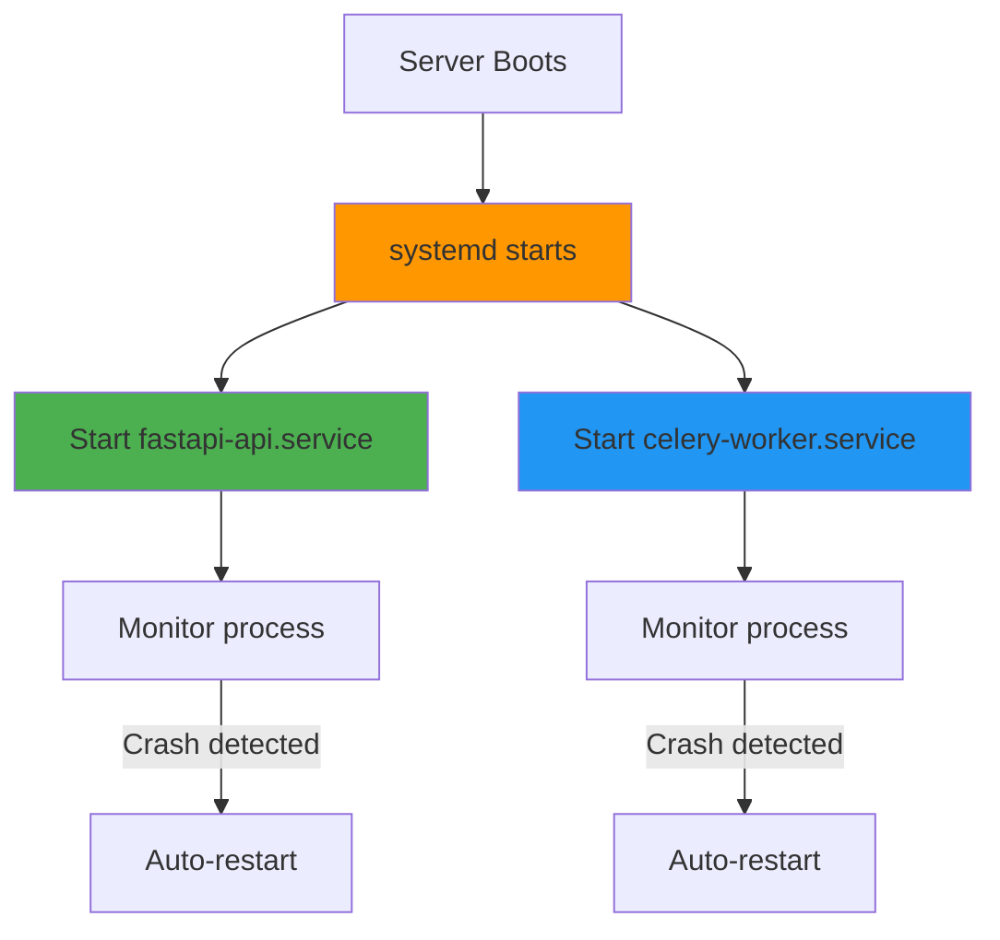

# systemd Services for Production

> **Learn why and how to run FastAPI and Celery as systemd services**

---

## Why systemd?

### Development (2 Terminals)

```bash
# Terminal 1 - FastAPI
uvicorn main:app --host 127.0.0.1 --port 5000

# Terminal 2 - Celery worker
celery -A tasks worker --loglevel=info
```

**Problems:**
- Stops when you close SSH
- No auto-restart on crashes
- Manual process management
- Hard to track logs

---

### Production (systemd)

```bash
# Both run as background services
sudo systemctl start fastapi-api
sudo systemctl start celery-worker
```

**Benefits:**
- ✅ Auto-start on server boot
- ✅ Auto-restart on crashes
- ✅ Centralized logging (`journalctl`)
- ✅ Runs even after SSH logout
- ✅ Easy start/stop/restart

---

## How systemd Works



---

## Step 1: Create FastAPI Service File

Create: `/etc/systemd/system/fastapi-api.service`

```bash
sudo nano /etc/systemd/system/fastapi-api.service
```

**Template:** See [examples/systemd/fastapi-api.service](../examples/systemd/fastapi-api.service)

### Key Points:

```ini
[Unit]
Description=FastAPI Application
After=network.target

[Service]
Type=simple
User=your-user
WorkingDirectory=/python-hosting/my-api
Environment="PATH=/python-hosting/my-api/venv/bin"
ExecStart=/python-hosting/my-api/venv/bin/uvicorn main:app --host 127.0.0.1 --port 8000
Restart=always

[Install]
WantedBy=multi-user.target
```

---

## Step 2: Create Celery Service File

Create: `/etc/systemd/system/celery-worker.service`

```bash
sudo nano /etc/systemd/system/celery-worker.service
```

**Template:** See [examples/systemd/celery-worker.service](../examples/systemd/celery-worker.service)

### Key Points:

```ini
[Unit]
Description=Celery Worker
After=network.target redis.service

[Service]
Type=simple
User=your-user
WorkingDirectory=/python-hosting/my-api
Environment="PATH=/python-hosting/my-api/venv/bin"
ExecStart=/python-hosting/my-api/venv/bin/celery -A tasks worker --loglevel=info
Restart=always

[Install]
WantedBy=multi-user.target
```

---

## Critical: Absolute Paths Required

### ❌ WRONG (won't work in systemd)

```ini
# systemd doesn't know about your shell environment
ExecStart=uvicorn main:app
ExecStart=celery -A tasks worker
```

### ✅ CORRECT (absolute paths)

```ini
# Use full paths to executables inside venv
ExecStart=/python-hosting/my-api/venv/bin/uvicorn main:app --host 127.0.0.1 --port 8000
ExecStart=/python-hosting/my-api/venv/bin/celery -A tasks worker --loglevel=info
```

**Why?**
- systemd doesn't run in your user shell
- No `.bashrc`, no `PATH` from your terminal
- Must specify exact location of executables

---

## Step 3: Enable and Start Services

```bash
# Reload systemd to recognize new services
sudo systemctl daemon-reload

# Enable services (auto-start on boot)
sudo systemctl enable fastapi-api
sudo systemctl enable celery-worker

# Start services now
sudo systemctl start fastapi-api
sudo systemctl start celery-worker
```

---

## Step 4: Verify Services are Running

```bash
# Check status
sudo systemctl status fastapi-api
sudo systemctl status celery-worker
```

**Expected output:**
```
● fastapi-api.service - FastAPI Application
   Loaded: loaded (/etc/systemd/system/fastapi-api.service; enabled)
   Active: active (running) since ...
```

---

## Common Operations

### Restart after code changes
```bash
sudo systemctl restart fastapi-api
sudo systemctl restart celery-worker
```

### Stop services
```bash
sudo systemctl stop fastapi-api
sudo systemctl stop celery-worker
```

### Check if service failed
```bash
sudo systemctl is-failed fastapi-api
```

### View recent logs
```bash
sudo journalctl -u fastapi-api -f
sudo journalctl -u celery-worker -f
```

---

## Customizing Service Files

### Change User

Replace `your-user` with your actual username:
```bash
whoami
# Output: ubuntu

# In service file:
User=ubuntu
```

### Change Project Path

Update all paths to match your project location:
```ini
WorkingDirectory=/python-hosting/my-api
Environment="PATH=/python-hosting/my-api/venv/bin"
ExecStart=/python-hosting/my-api/venv/bin/uvicorn main:app ...
```

**Note:** Common paths include `/python-hosting/<project>`, `/var/www/app`, or `/opt/app` - stay consistent.

### Add Environment Variables

```ini
[Service]
Environment="PATH=/python-hosting/my-api/venv/bin"
Environment="DATABASE_URL=postgresql://..."
Environment="REDIS_URL=redis://localhost:6379/0"
```

---

## Troubleshooting

### Service fails to start

```bash
# View detailed error logs
sudo journalctl -u fastapi-api -n 50 --no-pager

# Common issues:
# - Wrong path to venv
# - Missing dependencies
# - Wrong working directory
# - Permission issues
```

### Permission denied

```bash
# Make sure user in service file has access
sudo chown -R your-user:your-user /python-hosting/my-api
```

### Service restarts constantly

```bash
# Check logs to see error
sudo journalctl -u fastapi-api -f

# Usually means:
# - Import errors in Python code
# - Port already in use
# - Missing environment variables
```

---

## What's Next?

Your services are running! Now:
1. [Configure Nginx](04-nginx-config.md) - Setup reverse proxy
2. [Setup GitHub Actions](05-github-actions.md) - Automate deployments

---

## Quick Reference

### Service Files Location
- `/etc/systemd/system/fastapi-api.service`
- `/etc/systemd/system/celery-worker.service`

### Essential Commands
```bash
# After creating/editing service files
sudo systemctl daemon-reload

# Control services
sudo systemctl start|stop|restart|status <service-name>

# Enable auto-start on boot
sudo systemctl enable <service-name>

# View logs
sudo journalctl -u <service-name> -f
```

### Service Dependencies
- FastAPI service requires: `network.target`
- Celery service requires: `network.target`, `redis.service`
