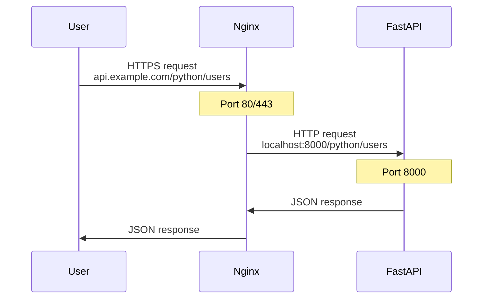

# Nginx Reverse Proxy Configuration

> **Setup Nginx to forward requests to your FastAPI application**

---

## What is a Reverse Proxy?

Nginx sits between users and your FastAPI app:



**Benefits:**
- ✅ Handle HTTPS/SSL
- ✅ Hide internal ports
- ✅ Serve multiple apps
- ✅ Add security headers
- ✅ Rate limiting

---

## Step 1: Create Nginx Config

```bash
sudo nano /etc/nginx/sites-available/python-app
```

**Basic configuration:**

```nginx
server {
    listen 80;
    server_name api.example.com;

    location /python {
        proxy_pass http://127.0.0.1:8000;
        proxy_http_version 1.1;

        # Preserve client information
        proxy_set_header Host $host;
        proxy_set_header X-Real-IP $remote_addr;
        proxy_set_header X-Forwarded-For $proxy_add_x_forwarded_for;
        proxy_set_header X-Forwarded-Proto $scheme;
    }
}
```

**Key point:** Location `/python` matches FastAPI `root_path="/python"`

---

## Step 2: Enable Configuration

```bash
# Create symbolic link
sudo ln -s /etc/nginx/sites-available/python-app /etc/nginx/sites-enabled/

# Test configuration
sudo nginx -t

# Reload Nginx
sudo systemctl reload nginx
```

---

## Understanding proxy_set_header

These headers pass client information to FastAPI:

```nginx
proxy_set_header Host $host;                    # Original hostname
proxy_set_header X-Real-IP $remote_addr;        # Client's real IP
proxy_set_header X-Forwarded-For $proxy_add_x_forwarded_for;  # Proxy chain
proxy_set_header X-Forwarded-Proto $scheme;     # HTTP or HTTPS
```

**Access in FastAPI:**

```python
from fastapi import Request

@app.get("/info")
def get_info(request: Request):
    return {
        "client_ip": request.headers.get("X-Real-IP"),
        "protocol": request.headers.get("X-Forwarded-Proto")
    }
```

---

## Production Configuration

```nginx
server {
    listen 80;
    server_name api.example.com;

    # Timeout for long-running requests
    proxy_connect_timeout 600;
    proxy_send_timeout 600;
    proxy_read_timeout 600;

    # FastAPI application
    location /python {
        proxy_pass http://127.0.0.1:8000;
        proxy_http_version 1.1;

        # WebSocket support (if needed)
        proxy_set_header Upgrade $http_upgrade;
        proxy_set_header Connection "upgrade";

        # Standard headers
        proxy_set_header Host $host;
        proxy_set_header X-Real-IP $remote_addr;
        proxy_set_header X-Forwarded-For $proxy_add_x_forwarded_for;
        proxy_set_header X-Forwarded-Proto $scheme;
    }

    # Serve static files directly (optional)
    location /static {
        alias /var/www/app/static;
        expires 30d;
    }
}
```

---

## Adding HTTPS with Let's Encrypt

```bash
# Install certbot
sudo apt install -y certbot python3-certbot-nginx

# Get SSL certificate
sudo certbot --nginx -d api.example.com

# Test auto-renewal
sudo certbot renew --dry-run
```

Certbot automatically updates config to redirect HTTP → HTTPS.

---

## Testing

```bash
# Test config syntax
sudo nginx -t

# Reload
sudo systemctl reload nginx

# Test endpoint
curl http://api.example.com/python/health
```

---

## Common Issues

### 502 Bad Gateway
**Cause:** Nginx can't reach FastAPI

**Fix:**
```bash
# Check FastAPI is running
sudo systemctl status fastapi-api

# Check port 8000 is listening
sudo netstat -tlnp | grep 8000

# Check logs
sudo journalctl -u fastapi-api -f
```

### 404 Not Found
**Cause:** Route mismatch

**Fix:** Ensure Nginx location matches FastAPI root_path
- Nginx: `location /python`
- FastAPI: `root_path="/python"`

---

## Multiple Applications

```nginx
server {
    listen 80;
    server_name api.example.com;

    # FastAPI app
    location /python {
        proxy_pass http://127.0.0.1:8000;
    }

    # Node.js app
    location /api {
        proxy_pass http://127.0.0.1:3000;
    }

    # Static website
    location / {
        root /var/www/html;
        index index.html;
    }
}
```

---

## What's Next?

1. [Setup GitHub Actions](05-github-actions.md) - Automate deployments
2. [Monitoring & Logs](06-monitoring.md) - Track your application

---

## Quick Reference

```bash
# Test config
sudo nginx -t

# Reload (no downtime)
sudo systemctl reload nginx

# Restart
sudo systemctl restart nginx

# Check status
sudo systemctl status nginx

# View logs
sudo tail -f /var/log/nginx/error.log
```

**Config locations:**
- Available: `/etc/nginx/sites-available/`
- Enabled: `/etc/nginx/sites-enabled/`
- Logs: `/var/log/nginx/`
