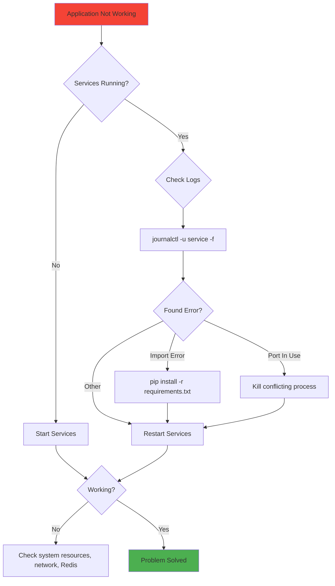

# Monitoring & Troubleshooting

> **Essential commands for monitoring your production application**

---

## Quick Health Check

```bash
# Check all services at once
sudo systemctl status fastapi-api celery-worker redis nginx
```

---

## Service Status

### Check if services are running:

```bash
# FastAPI
sudo systemctl status fastapi-api

# Celery
sudo systemctl status celery-worker

# Redis
sudo systemctl status redis

# Nginx
sudo systemctl status nginx
```

**Look for:** `Active: active (running)`

---

## Viewing Logs

### FastAPI Logs (Real-time)

```bash
sudo journalctl -u fastapi-api -f
```

**What you'll see:**
- API requests
- Errors and exceptions
- Application startup messages

---

### Celery Logs (Real-time)

```bash
sudo journalctl -u celery-worker -f
```

**What you'll see:**
- Task execution
- Worker status
- Task failures

---

### Exit Log Viewer

Press `Ctrl + C` to stop following logs.

---

## Common Monitoring Tasks

### 1. After Deployment

```bash
# Check if services restarted successfully
sudo systemctl status fastapi-api celery-worker

# Watch logs for errors
sudo journalctl -u fastapi-api -f
```

---

### 2. Debugging Errors

```bash
# View FastAPI logs
sudo journalctl -u fastapi-api -f

# Common errors:
# - ImportError: missing package
# - Port already in use
# - Database connection failed
```

---

### 3. Performance Issues

```bash
# Check CPU and memory
htop

# Check disk space
df -h

# Check network connections
sudo netstat -tulpn | grep 5000
```

---

## Restarting Services

### Restart after code changes:

```bash
sudo systemctl restart fastapi-api
sudo systemctl restart celery-worker
```

### Restart Nginx after config changes:

```bash
# Test config first
sudo nginx -t

# Then reload (no downtime)
sudo systemctl reload nginx
```

---

## Common Issues and Solutions

### Issue: FastAPI not responding

```bash
# 1. Check if service is running
sudo systemctl status fastapi-api

# 2. Check logs for errors
sudo journalctl -u fastapi-api -f

# 3. Try restarting
sudo systemctl restart fastapi-api
```

---

### Issue: Celery tasks not processing

```bash
# 1. Check Celery worker
sudo systemctl status celery-worker

# 2. Check Redis is running
redis-cli ping
# Should return: PONG

# 3. Check Celery logs
sudo journalctl -u celery-worker -f

# 4. Restart Celery
sudo systemctl restart celery-worker
```

---

### Issue: 502 Bad Gateway (Nginx)

```bash
# 1. Check if FastAPI is running
sudo systemctl status fastapi-api

# 2. Check if port 5000 is listening
sudo netstat -tulpn | grep 5000

# 3. Check Nginx error log
sudo tail -f /var/log/nginx/error.log

# 4. Restart FastAPI
sudo systemctl restart fastapi-api
```

---

### Issue: Code changes not visible

```bash
# 1. Check latest commit
cd /python-hosting/my-api
git log -1

# 2. Pull latest code
git pull origin main

# 3. Install dependencies
source venv/bin/activate
pip install -r requirements.txt

# 4. Restart services
sudo systemctl restart fastapi-api celery-worker
```

---

## Diagnostic Commands

### Check Python environment:

```bash
cd /python-hosting/my-api
source venv/bin/activate
python --version
pip list
```

---

### Check Redis:

```bash
# Test connection
redis-cli ping

# Check Redis info
redis-cli info

# View current keys
redis-cli keys '*'
```

---

### Check network ports:

```bash
# See what's listening
sudo netstat -tulpn

# Specifically check port 5000
sudo netstat -tulpn | grep 5000

# Check Nginx port
sudo netstat -tulpn | grep 80
```

---

### Check disk space:

```bash
df -h
```

If low on space:
```bash
# Clean old logs
sudo journalctl --vacuum-time=7d

# Clean pip cache
pip cache purge
```

---

## Log Locations

| Service | Log Command |
|---------|-------------|
| FastAPI | `sudo journalctl -u fastapi-api -f` |
| Celery | `sudo journalctl -u celery-worker -f` |
| Nginx Error | `sudo tail -f /var/log/nginx/error.log` |
| Nginx Access | `sudo tail -f /var/log/nginx/access.log` |

---

## Service Management Cheat Sheet

```bash
# Start service
sudo systemctl start <service-name>

# Stop service
sudo systemctl stop <service-name>

# Restart service
sudo systemctl restart <service-name>

# Check status
sudo systemctl status <service-name>

# Enable auto-start on boot
sudo systemctl enable <service-name>

# Disable auto-start
sudo systemctl disable <service-name>
```

---

## Performance Monitoring

### Install htop (if not installed):

```bash
sudo apt install -y htop
```

### Monitor system resources:

```bash
htop
```

**Look for:**
- CPU usage
- Memory usage
- Running processes

---

### Monitor specific processes:

```bash
# Find FastAPI process
ps aux | grep uvicorn

# Find Celery process
ps aux | grep celery
```

---

## Setting Up Alerts (Optional)

### Simple email alert on service failure:

Edit service file to add email notification:

```ini
[Service]
OnFailure=notify-email@%i.service
```

---

## Backup Strategy

### Important files to backup:

```bash
# Application code (use Git)
cd /python-hosting/my-api
git status

# Service files
/etc/systemd/system/fastapi-api.service
/etc/systemd/system/celery-worker.service

# Nginx config
/etc/nginx/sites-available/python-app

# Environment variables
/python-hosting/my-api/.env
```

---

## Security Monitoring

### Check failed SSH attempts:

```bash
sudo grep "Failed password" /var/log/auth.log
```

### Check active connections:

```bash
sudo netstat -tulpn
```

### Update packages regularly:

```bash
sudo apt update
sudo apt upgrade -y
```

---

## Quick Troubleshooting Workflow



---

## Essential Daily Commands

```bash
# Morning health check
sudo systemctl status fastapi-api celery-worker nginx redis

# Watch for errors (open in separate terminal)
sudo journalctl -u fastapi-api -f
sudo journalctl -u celery-worker -f

# After deployment
git log -1                                      # Verify latest commit
sudo systemctl restart fastapi-api celery-worker
sudo journalctl -u fastapi-api -f              # Watch for errors
```

---

## When Things Go Wrong

1. **Don't panic** - check status first
2. **Read logs** - they usually tell you what's wrong
3. **Check basics** - is Redis running? Is port available?
4. **Restart services** - fixes 80% of issues
5. **Check recent changes** - did deployment work?

---

## Getting Help

If stuck:
1. Read error messages carefully
2. Check GitHub Issues for similar problems
3. Search error messages on Stack Overflow
4. Review this guide from the beginning

---

## Maintenance Checklist

### Weekly:
- [ ] Check disk space: `df -h`
- [ ] Review error logs
- [ ] Update packages: `sudo apt update && sudo apt upgrade`

### Monthly:
- [ ] Clean old logs: `sudo journalctl --vacuum-time=30d`
- [ ] Review service performance
- [ ] Test backup/restore process

---

## Quick Reference

### Most Used Commands:

```bash
# Status check
sudo systemctl status fastapi-api

# View logs
sudo journalctl -u fastapi-api -f

# Restart service
sudo systemctl restart fastapi-api

# Check port
sudo netstat -tulpn | grep 5000

# Check Redis
redis-cli ping
```

---

**You now have everything you need to deploy, monitor, and maintain a production FastAPI application!** 🚀
